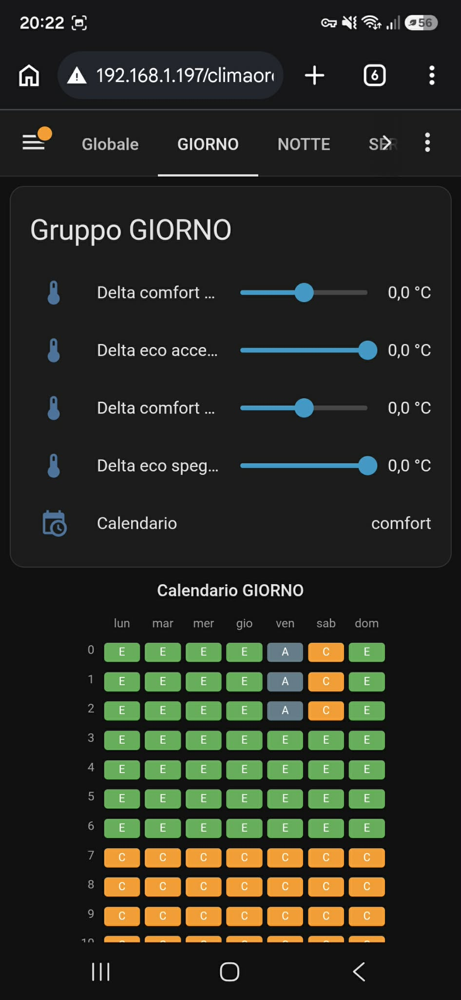
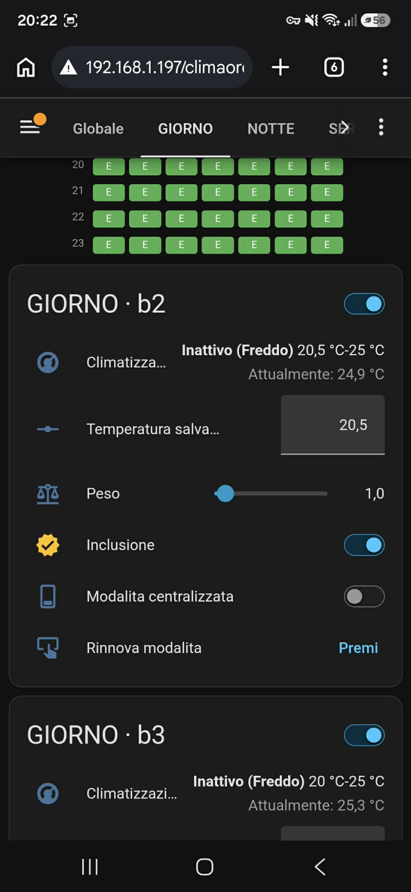
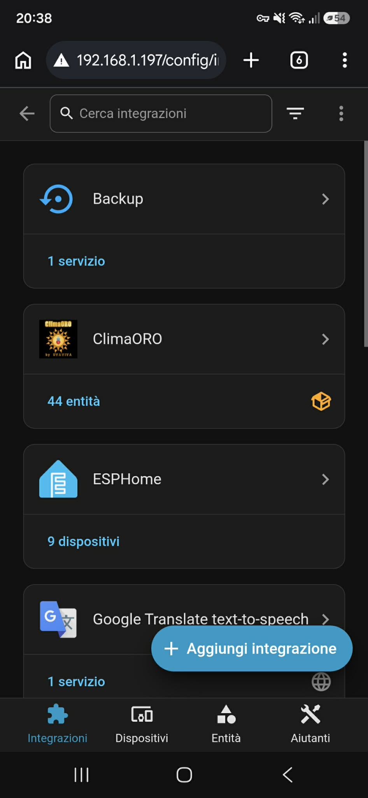

# CLIMAORO — Integrazione Home Assistant
**Modulo Custom Component + AppDaemon per la gestione centralizzata ed intelligente del riscaldamento su Home Assistant.**

---

## Links

- **Sito web:** [https://UVAVIVA.github.io/CLIMAORO/](https://UVAVIVA.github.io/CLIMAORO/)
- **Progetto principale:** [https://github.com/UVAVIVA/CLIMAORO](https://github.com/UVAVIVA/CLIMAORO)

---

## L'Architettura

L'integrazione CLIMAORO per Home Assistant permette di orchestrare e supervisionare l'intero impianto di riscaldamento radiante senza privare i singoli termostati della loro capacità di funzionamento autonomo a livello di firmware.

L'elemento chiave dell'architettura è la natura **Rename-Proof**: nessun `entity_id` è codificato in modo rigido. L'integrazione e la componente AppDaemon risolvono dinamicamente l'albero dei dispositivi interrogando l'endpoint dedicato `/api/climaoro/config`. Se un'entità viene rinominata nel registro di Home Assistant, la configurazione si aggiorna automaticamente in tempo reale senza interrompere l'operatività del sistema.

---

## Componenti del Sistema

L'integrazione si articola in tre parti principali:

| Componente | Posizione | Ruolo e Funzione |
| --- | --- | --- |
| **Custom Component** | `custom_components/climaoro/` | Integrazione nativa HA. Offre il wizard di prima configurazione (*Config Flow*), gli endpoint REST/WebSocket per l'aggiornamento runtime e le entità di contorno (`switch`, `number`, `sensor`). |
| **AppDaemon Engine** | `appdaemon/climaoro.py` | Il motore decisionale Python. Esegue l'algoritmo di regolazione, gestisce le priorità di gruppo, la matrice calendari e i tempi di rinnovo (*heartbeat*). |
| **Pannello & Card 7x24** | `www/climaoro/` | Dashboard dedicata (`/climaoro-panel`) con vista multi-pagina e la card personalizzata `climaoro-calendario.js` per la gestione visuale delle fasce orarie. |

---

## Modello Dati e Struttura

Il sistema è predisposto per la gestione indipendente di **due unità abitative** (*Casa* e *Appartamento*), strutturate in modo gerarchico:

### 1. Stanze

Ogni stanza è associata a un appartamento e a un gruppo specifico, definendo un proprio *peso* e uno stato di *inclusione*. Ogni termostato mappa 4 entità fondamentali:

- `climate.<dev>_climatizzazione` — Gestione stato operativo e setpoint target.
- `number.<dev>_temperatura_salvata` — Riferimento di base della stanza.
- `switch.<dev>_modalita_centralizzata` — Abilitazione del controllo da parte del motore centralizzato.
- `button.<dev>_rinnovo_modalita_centralizzata` — Pulsante di heartbeat per l'estensione del lease.

### 2. Gruppi (Giorno / Notte / Servizi)

Ciascun gruppo applica impostazioni omogenee per le stanze afferenti:

- **4 Delta Termici**: Offset di accensione e spegnimento per le fasce *Comfort* ed *Eco* (sommati al valore `temp_salvata`).
- **Calendario 7x24**: Matrice oraria settimanale per la selezione automatica della modalità (*Comfort*, *Eco*, *Autonomo*).

### 3. Appartamenti

Ogni appartamento dispone del proprio switch Master (`climaoro_attivo` / `climaoro_appartamento_attivo`) e della relativa soglia minima dei pesi per l'attivazione del generatore.





---

## Logica Decisionale & Sicurezza

L'app AppDaemon valuta lo stato dell'impianto a intervalli regolari (default: 60 secondi):

```
                       [ Ciclo di Controllo (60s) ]
                                    │
                                    ▼
                      Fascia Oraria in Autonomo?
                       ├── SI ──► Termostato gestito da Firmware
                       └── NO ──► Calcolo Setpoint (Attesa / Lavoro)
                                    │
                                    ▼
                       Soglia Richiesta Raggiunta?
                   (Temp. Reale <= Temp. Salvata - 0.5°C)
                                    │
                  ┌─────────────────┴─────────────────┐
                  ▼                                   ▼
          Qualcuno Scalda?                    Pesi >= Soglia?
           (action=heating)
                  │                                   │
         ┌────────┴────────┐                 ┌────────┴────────┐
         ▼                 ▼                 ▼                 ▼
     Accendi           Emergenza         Accendi           Emergenza
    Richiedenti       Individuale       Richiedenti       Individuale
```

### Algoritmo di Valutazione

1. **Calcolo Setpoint**:
   - **Stato Attesa (spento)**: Setpoint = T_salvata + Delta_accensione
   - **Stato Lavoro (acceso)**: Setpoint = T_salvata + Delta_spegnimento

2. **Identificazione Richieste**: Una stanza richiede calore quando T_reale <= T_salvata - 0.5°C.

3. **Cascata di Attivazione**:
   - **Priorità Riscaldamento**: Se una stanza del gruppo è già attiva (`heating`), le altre richiedenti si accendono immediatamente.
   - **Soglia Pesi**: Se la somma dei pesi richiedenti >= Soglia, scatta l'accensione collettiva del gruppo.
   - **Emergenza Individuale**: Se T_reale <= T_salvata + Delta_accensione - 0.4°C, la stanza si accende singolarmente in modalità lavoro.

### Protezione e Controllo Centralizzato

- **Check Centralizzata**: Prima di inviare comandi ad un'entità `climate`, l'app verifica che `modalita_centralizzata` sia ON. In caso contrario la forza e ricontrolla (fino a 2 tentativi).
- **Rinnovo Heartbeat**: Un timer periodico (default: 240s) preme il pulsante di rinnovo sui termostati per mantenere il controllo attivo.
- **Ri-assert Automatico**: Ogni 1200s viene riconfermata la modalità centralizzata su tutti i termostati inclusi per recuperare da eventuali riavvii hardware dei dispositivi.
- **Aggiornamento Istantaneo**: Qualsiasi variazione dei parametri da interfaccia scatena l'evento `climaoro_config_updated`, forzando l'aggiornamento immediato in AppDaemon senza attendere il refresh di background.





---

## Installazione e Configurazione

Il progetto si installa in un **unico passo**: il Custom Component. L'integrazione si occupa automaticamente di tutto il resto (file di configurazione di AppDaemon, token, dashboard e card del calendario).

### 1. Prerequisito

Installare l'add-on **AppDaemon** da *Impostazioni -> Componenti aggiuntivi -> Add-on Store* in Home Assistant (obbligatorio: è il motore decisionale del sistema).

### 2. Custom Component

1. Copiare la cartella `custom_components/climaoro/` all'interno della directory `<config>/custom_components/` del server Home Assistant.
2. Riavviare Home Assistant.
3. Completare la procedura guidata da **Impostazioni -> Dispositivi e Servizi -> Aggiungi Integrazione -> Climaoro**.

### 3. Provisioning Automatico

Al termine del wizard, l'integrazione esegue da sola (senza intervento manuale) tutta la configurazione:

- genera un **long-lived token** per l'accesso di AppDaemon;
- scrive **automaticamente** `climaoro.py` + `apps.yaml` nella cartella `apps/` dell'add-on AppDaemon;
- **riavvia** l'add-on AppDaemon per caricare la nuova configurazione;
- crea/aggiorna la **dashboard Lovelace "Climaoro"** (`/climaoro-panel`) con tutte le viste per appartamenti e gruppi;
- registra la risorsa frontend della **card calendario 7x24** editabile.

L'utente **non deve** creare o copiare a mano alcun file `.py` o `apps.yaml`: li genera l'integrazione. La card del calendario, una volta registrata, è direttamente modificabile tramite l'interfaccia della dashboard.

---

## Licenza e Responsabilità

**CLIMAORO © 2026 by UVAVIVA** · Licenza: **MIT con Condizione di Attribuzione**

**Termini**
- ✅ Attribuzione richiesta (nel codice e sui dispositivi commerciali)
- ✅ Uso commerciale permesso (con attribuzione)
- ✅ Modifiche e derivati permessi
- ✅ Uso, copia, distribuzione e vendita permessi

**Disclaimer**
Questo progetto è fornito **così com'è**, a scopo educativo e sperimentale.
- ⚠️ Non certificato per uso produttivo
- ⚠️ ⚡ **PERICOLO: la gestione dell'impianto di riscaldamento deve essere eseguita solo da personale qualificato**
- ⚠️ Nessuna garanzia di alcun tipo
- ⚠️ L'utente si assume ogni rischio

**Rispettare sempre le normative locali relative agli impianti termoidraulici.**

**Sviluppato da:** [UVAVIVA](https://github.com/UVAVIVA)

---

**Costruito con passione, dal nulla.**
